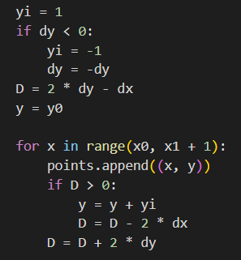

## Needed adjustments to the algorithm I have made for the slope of m>1

When adjusting the Bresenham's line drawing algorithm for the slope \( m > 1 \), several modifications are necessary compared to the case when \( 0 < m < 1 \).
Here are the adjustments that were needed:

1. **Iteration along y-axis**:
   In the traditional algorithm for \( 0 < m < 1 \), the iteration is performed along the x-axis.
   However, for \( m > 1 \), it's more efficient to iterate along the y-axis.
   Because, in this scenario, the change in the y-coordinate between consecutive points is always 1,
   while the change in the x-coordinate can be greater than 1.
   Iterating along the y-axis simplifies the calculations and ensures that each pixel is visited exactly once along the line.

2. **Interchange of roles of x and y**:
   In the traditional algorithm for \( 0 < m < 1 \), the roles of x and y are swapped when the slope is greater than 1.
   This means that the decision parameter calculation and the pixel selection process are based on changes in the y-coordinate rather than the x-coordinate.
   Swapping the roles of x and y ensures that the algorithm accurately selects the pixels along the line with a slope greater than 1.

    

Here we can see how the roles of x and y interchanged.

3. **Adjustment of decision parameter**:
   The decision parameter (\( D \)) calculation is adjusted to reflect the change in the role of x and y.
   In the traditional algorithm for \( 0 < m < 1 \), \( D \) is calculated based on changes in the x-coordinate.
   However, for \( m > 1 \), \( D \) is calculated based on changes in the y-coordinate.
   This adjustment ensures that the decision parameter accurately determines which pixel to select at each step along the line.

    

Here we can see, how the decision parameter was adjusted.

## Output

**For 0 < m < 1**

**For m > 1**

